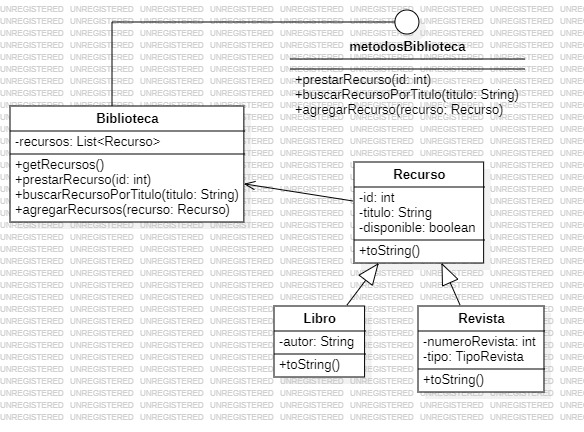

# Ejercicio Biblioteca

Creación del sistema de una biblioteca para registrar Recursos los cuales pueden ser **Revistas** o **Libros**.

## Diagrama de de clase


## Uso del Proyecto

Clona este repositorio en tu maquina local:

```BASH
git clone https://github.com/jstorra/BibliotecaJuanTorra.git
```

---

<p align="center">Developed by <a href="https://github.com/jstorra">@jstorra</a></p>